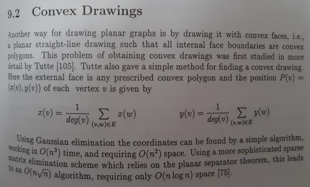
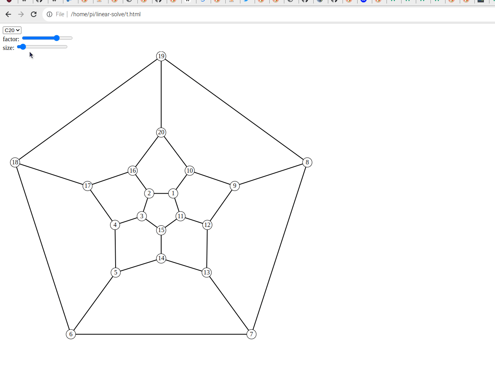
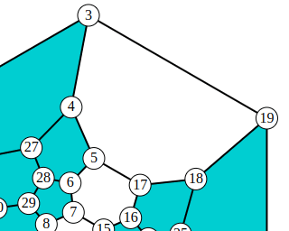
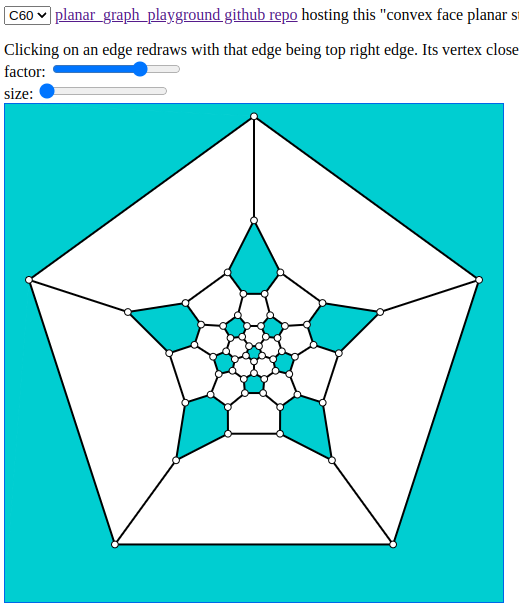
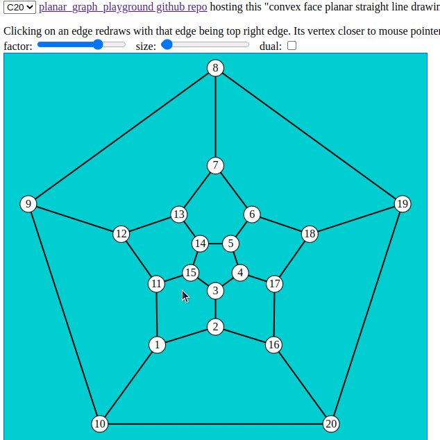
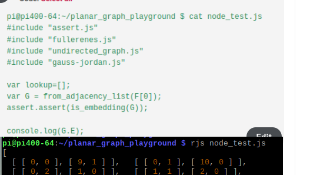
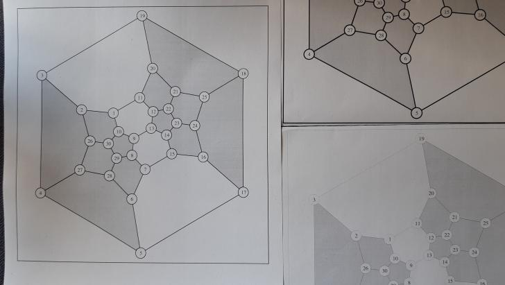

# planar_graph_playground
JavaScript playground for drawing planar graphs (eg. fullerenes) in browser, or as eg. PostScript file with command line tool rjs (run nodejs script) and "JavaScript with C includes" script.

## gaus-jordan.js

Simple Node.JS solver for system of linear equations module is taken from:  
[https://github.com/lovasoa/linear-solve/blob/master/gauss-jordan.js](https://github.com/lovasoa/linear-solve/blob/master/gauss-jordan.js)

Made it usable for browser JavaScript by changing 1 line and deleting 5 lines only.

## assert.js

```assert()``` for JavaScript, with file and line number logged in console.

## undirected_graph.js

Implementation of undirect graph as well as embedding functions.  

Just ```forall_edges(G, f)``` as example ...

	function forall_edges(G, f) {
	    var v;
	    for (v = 0; v < G.length; v += 1) {
	        G[v].forEach(function (w) {
	            if (v < w) {
	                f(v, w);
	            }
	        });
	    }
	}

... used to draw SVG lines for all edges like this:  

	  forall_edges(G, function(v, w){
	    cx=l/2+(l/2-r)*coords[0][v];
	    cy=l/2+(l/2-r)*coords[1][v];
	    dx=l/2+(l/2-r)*coords[0][w];
	    dy=l/2+(l/2-r)*coords[1][w];
	    document.write('<line class="l" x1="'+cx+'" y1="'+cy+'" x2="'+dx+'" y2="'+dy+'"></line>');
	  })

## tutte.js

Function ```tutte(Emb, face, factor)``` computes x/y coordinates for convex planar straight line drawings of embedding ```Emb```, with array ```face``` vertices on the outer face.  


## fullerenes.js

Sample fullerenes C20, C30, ..., C70 adjacency lists.

## htmlsvg.js

Function ```header``` writes select and slider elements of HTML page to ```document```.

Function ```straight_line_drawing(G, coords, length, r)``` creates SVG output of size length×length, with straight line drawing of graph G with vertex array coords coordinates, and vertex label radius r.

## ps.js

```ps.js``` is counterpart to ```htmlsvg.js```, creates PostScript drawing instead of HTML SVG drawing.

Function ```header``` writes basic ProstScript defines and settings.

Function ```straight_line_drawing(G, coords, length, r)``` creates PostScript output of size length×length, with straight line drawing of graph G with vertex array coords coordinates, and vertex label radius r.

## convex_face_straight_line_drawing.js

Created by externalizing remaining JavaScript in ```index.html```.

## index.html

Browser demo application for drawing fullerenes C20, C30, ..., C70, with quite some browser interaction. See this forum posting for current details:  
[https://forums.raspberrypi.com/viewtopic.php?p=1991331#p1991331](https://forums.raspberrypi.com/viewtopic.php?p=1991331#p1991331)  

Just learned how to setup Github Pages, and how to add submodule. After few minutes submodule ```planar_graph_playground``` was public, you can play now with the demo aplication!  
[https://hermann-sw.github.io/planar_graph_playground/](https://hermann-sw.github.io/planar_graph_playground/)  

Peek screenrecorder animated .gif showcasing initial application:  


### new edge representation allows for better edge selection

Latest commits made edge selection different. Now you just cick on an edge,
and the edge vertex closer to mouse cursor becomes top vertex of outer face,
and selected edge becomes top right edge:  


With new commits outer face can be filled as well now.  
So for fullerenes,
always 12 pentagons are filled, regardless of outer face vertex count:  


### added "dual" checkbox allows for drawing selected fullerene or its dual graph

[https://forums.raspberrypi.com/viewtopic.php?p=1995804#p1996069](https://forums.raspberrypi.com/viewtopic.php?p=1995804#p1996069)  



## Executing JavaScript with C #include statements using rjs tool

Since the shown JavaScript files are for browser, they do not have module 
exports needed for nodejs require statements.  

C preprocessor #include statements are made available for JavaScript with [rjs](rjs) tool (Run JavaScript) for nodejs execution:  

    #!/bin/bash
    gcc -E -x c -nostdinc $1 | grep -v "^#"  | node

### node_test.js
Simple example nodejs script making use of several browser scripts in this repo:  


### node_dual.js
Simple example nodejs script for testing new "dual_graph()" function:  

    #include "assert.js"
    #include "fullerenes.js"
    #include "undirected_graph.js"
    #include "gauss-jordan.js"
    
    var lookup = [];
    var K4 = [[1, 3, 2], [2, 3, 0], [0, 3, 1], [0, 1, 2]];
    var K5me = [[1, 2, 3, 4], [2, 0, 4], [4, 3, 0, 1], [4, 0, 2], [1, 0, 3, 2]];
    var D;
    var G = from_adjacency_list(K5me);
    
    assert.assert(is_embedding(G));
    console.log("is_embedding(K5-e) verified, has " + n_faces_planar(G) + " faces");
    print_graph(G, "K5-e: ");
    
    D = dual_graph(G);
    assert.assert(is_embedding(D));
    console.log("is_embedding(dual_graph(K5-e)) verified, has " + n_faces_planar(D) + " faces");
    print_graph(D, "dual_graph(K5-e): ");


Output:  

    pi@pi400-64:~/planar_graph_playground $ rjs node_dual.js 
    is_embedding(K5-e) verified, has 6 faces
    K5-e: 5 vertices, 9 edges
    0: (0)1 (1)2 (2)3 (3)4
    1: (4)2 (0)0 (5)4
    2: (6)4 (7)3 (1)0 (4)1
    3: (8)4 (2)0 (7)2
    4: (5)1 (3)0 (8)3 (6)2
    is_embedding(dual_graph(K5-e)) verified, has 5 faces
    dual_graph(K5-e): 6 vertices, 9 edges
    0: (0)1 (5)4 (3)3
    1: (0)0 (1)2 (4)4
    2: (1)1 (2)3 (7)5
    3: (2)2 (3)0 (8)5
    4: (4)1 (6)5 (5)0
    5: (6)4 (7)2 (8)3
    pi@pi400-64:~/planar_graph_playground $ 


### node.convex_face_straight_line_drawing.js

Simple example nodejs script generating PostScript output (C30 fullerene for now):  

    $ rjs node.convex_face_straight_line_drawing.js > C30.ps
    $ 

[C30.ps](C30.ps) laser printouts, linewidth 1(left) which is checked in line thickness, and linewidth 2/0(right top/bottom).  

