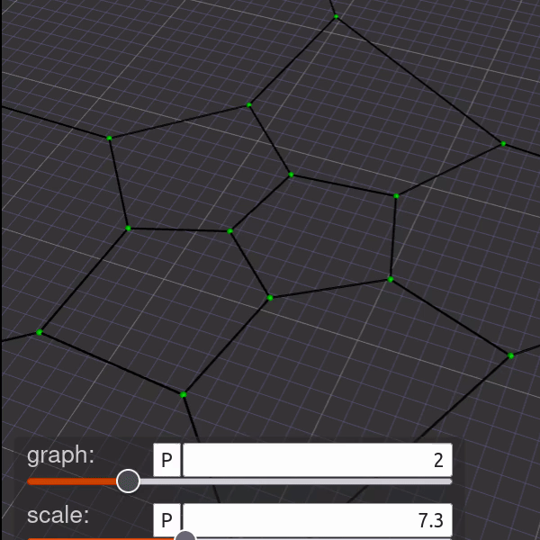
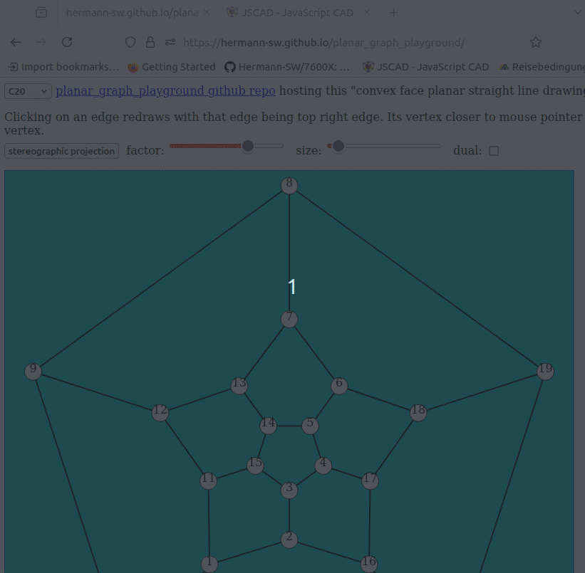
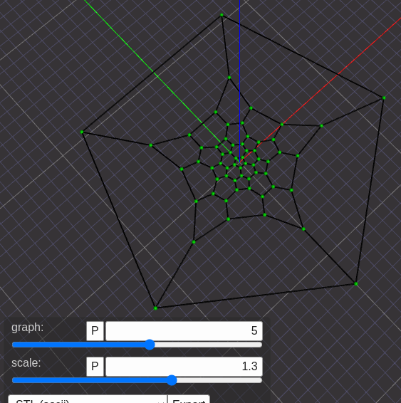

# planar_graph_playground

Lots of stuff has been implemented (JSCAD and OpenSCAD output for 3D), and this README.md needs to be updated. The forum threads give information of current development. (Half-)sphere vertices, vertex text, spherical edges and spherical polygons are (JSCAD and OpenSCAD) modules implemented in this repo. Here is just a small example of C36.10 fullerene embedded onto sphere, animated by OpenSCAD:  
  
(planar graphs can be embedded onto sphere because of bijection of sphere minus north pole and plane)  

More information on 199x work [here](https://stamm-wilbrandt.de/en/#pgp)

---

JavaScript playground for drawing planar graphs (eg. fullerenes) in browser, or as eg. PostScript file with command line tool rjs (run nodejs script) and "JavaScript with C includes" script.  

Subdirectory [python](python) contains port to Python, see its [README.md](python/README.md) for details. JavaScript and Python libs will be kept in sync.


## gaus-jordan.js

Simple Node.JS solver for system of linear equations module is taken from:  
[https://github.com/lovasoa/linear-solve/blob/master/gauss-jordan.js](https://github.com/lovasoa/linear-solve/blob/master/gauss-jordan.js)

Made it usable for browser JavaScript by changing 1 line and deleting 5 lines only.

## assert.js

```assert()``` for JavaScript, with file and line number logged in console.

## undirected_graph.js

Implementation of undirect graph as well as embedding functions.  

Just ```forall_edges(G, f)``` as example ...

	function forall_edges(G, f) {
	    var v;
	    for (v = 0; v < G.length; v += 1) {
	        G[v].forEach(function (w) {
	            if (v < w) {
	                f(v, w);
	            }
	        });
	    }
	}

... used to draw SVG lines for all edges like this:  

	  forall_edges(G, function(v, w){
	    cx=l/2+(l/2-r)*coords[0][v];
	    cy=l/2+(l/2-r)*coords[1][v];
	    dx=l/2+(l/2-r)*coords[0][w];
	    dy=l/2+(l/2-r)*coords[1][w];
	    document.write('<line class="l" x1="'+cx+'" y1="'+cy+'" x2="'+dx+'" y2="'+dy+'"></line>');
	  })

## tutte.js

Function ```tutte(Emb, face, factor)``` computes x/y coordinates for convex planar straight line drawings of embedding ```Emb```, with array ```face``` vertices on the outer face.  


The fullerenes C20, C30 and C40 available in fullerenes.js are slight modifications of each other, modifying only one pentagon face by inserting a new pentagon and connecting to new middle vertices of outer pentaggon edges. The animation demonstrates that local changes in a Tutte embedding have effects on all other vertex coordinates besides the outer face fixated vertices:  


## fullerenes.js

Sample fullerenes C20, C30, ..., C70 adjacency lists.

## htmlsvg.js

Function ```header``` writes select and slider elements of HTML page to ```document```.

Function ```straight_line_drawing(G, coords, length, r)``` creates SVG output of size length×length, with straight line drawing of graph G with vertex array coords coordinates, and vertex label radius r.

## ps.js

```ps.js``` is counterpart to ```htmlsvg.js```, creates PostScript drawing instead of HTML SVG drawing.

Function ```header``` writes basic ProstScript defines and settings.

Function ```straight_line_drawing(G, coords, length, r)``` creates PostScript output of size length×length, with straight line drawing of graph G with vertex array coords coordinates, and vertex label radius r.

## convex_face_straight_line_drawing.js

Created by externalizing remaining JavaScript in ```index.html```.

## index.html

Browser demo application for drawing fullerenes C20, C30, ..., C70, with quite some browser interaction. See this forum posting for current details:  
[https://forums.raspberrypi.com/viewtopic.php?p=1991331#p1991331](https://forums.raspberrypi.com/viewtopic.php?p=1991331#p1991331)  

Just learned how to setup Github Pages, and how to add submodule. After few minutes submodule ```planar_graph_playground``` was public, you can play now with the demo aplication!  
[https://hermann-sw.github.io/planar_graph_playground/](https://hermann-sw.github.io/planar_graph_playground/)  

Peek screenrecorder animated .gif showcasing initial application:  


### new edge representation allows for better edge selection

Latest commits made edge selection different. Now you just cick on an edge,
and the edge vertex closer to mouse cursor becomes top vertex of outer face,
and selected edge becomes top right edge:  


With new commits outer face can be filled as well now.  
So for fullerenes,
always 12 pentagons are filled, regardless of outer face vertex count:  


### added "dual" checkbox allows for drawing selected fullerene or its dual graph

[https://forums.raspberrypi.com/viewtopic.php?p=1995804#p1996069](https://forums.raspberrypi.com/viewtopic.php?p=1995804#p1996069)  


### stereographic projection 

Clicking "stereographic projection" button opens JSCAD stereographic projection of current graph in a named browser tab:  


JSCAD application allows to select three edge types:  
1. straight line  
2. great circle arc
3. spherical circle arc (needed for stereographic projection)

Bottom black planar graph (in z=-1 plane) can be scaled with (animation) slider.  
Scale factor determines the stereographic mapping.  
Initial scale factor is computed so that half of the vertices get mapped above the equator:  


First maximal planar graph on 7 vertices mp7 demonstrates that stereographic (north pole) projection is crossing free, while selecting great circle arcs as edges (etype=2) shows an edge crossing (for these vertex coordinates):  


## Running planar_graph_playground inside JSCAD

I extracted all needed code from all scripts used in index.html but htmlsvg.js as basis for implementation:  
```
pi@raspberrypi5:~/planar_graph_playground $ for f in `grep script index.html | cut -f2 -d\" | grep -v htmlsvg`
> do
> cat $f
> done |
> gcc -E -x c - |
> grep -v "^#" > cfsld.js
pi@raspberrypi5:~/planar_graph_playground $
```
Then added parts of above stereographic projection JSCAD script and glued together.  
Two animation sliders allow to
- switch between 10 graphs
- change Tutte embedding scaling factor  


Try it out:  
https://jscad.app/#https://raw.githubusercontent.com/Hermann-SW/planar_graph_playground/main/convex_face_straight_line_drawing.jscad


### 3Dprint of slightly changed JSCAD model

This little change replacing cylinder with cuboid for the edges  
```
< let edgeCylinder = cylinder({radius:er, height:1})
---
> let edgeCylinder = cuboid({size:[er,er,1],center:[2.5*er,0,0]})
```
and moving edges down to bottom of vertex spheres (and recoloring for better view) makes better 3Dprint:  
  
I just exported with JSCAD as STL, sliced with Prusaslicer and 3Dprinted.  

Flat dodecahedron (C20) next to its 3D toothpick version:  


## Executing JavaScript with C #include statements using rjs tool

Since the shown JavaScript files are for browser, they do not have module 
exports needed for nodejs require statements.  

C preprocessor #include statements are made available for JavaScript with [rjs](rjs) tool (Run JavaScript) for nodejs execution:  

    #!/bin/bash
    gcc -E -x c -nostdinc $1 | grep -v "^#"  | node

### node_test.js
Simple example nodejs script making use of several browser scripts in this repo:  


### node_dual.js
Simple example nodejs script for testing new "dual_graph()" function:  

    #include "assert.js"
    #include "fullerenes.js"
    #include "undirected_graph.js"
    #include "gauss-jordan.js"
    
    var lookup = [];
    var K4 = [[1, 3, 2], [2, 3, 0], [0, 3, 1], [0, 1, 2]];
    var K5me = [[1, 2, 3, 4], [2, 0, 4], [4, 3, 0, 1], [4, 0, 2], [1, 0, 3, 2]];
    var D;
    var G = from_adjacency_list(K5me);
    
    assert.assert(is_embedding(G));
    console.log("is_embedding(K5-e) verified, has " + n_faces_planar(G) + " faces");
    print_graph(G, "K5-e: ");
    
    D = dual_graph(G);
    assert.assert(is_embedding(D));
    console.log("is_embedding(dual_graph(K5-e)) verified, has " + n_faces_planar(D) + " faces");
    print_graph(D, "dual_graph(K5-e): ");


Output:  

    pi@pi400-64:~/planar_graph_playground $ rjs node_dual.js 
    is_embedding(K5-e) verified, has 6 faces
    K5-e: 5 vertices, 9 edges
    0: (0)1 (1)2 (2)3 (3)4
    1: (4)2 (0)0 (5)4
    2: (6)4 (7)3 (1)0 (4)1
    3: (8)4 (2)0 (7)2
    4: (5)1 (3)0 (8)3 (6)2
    is_embedding(dual_graph(K5-e)) verified, has 5 faces
    dual_graph(K5-e): 6 vertices, 9 edges
    0: (0)1 (5)4 (3)3
    1: (0)0 (1)2 (4)4
    2: (1)1 (2)3 (7)5
    3: (2)2 (3)0 (8)5
    4: (4)1 (6)5 (5)0
    5: (6)4 (7)2 (8)3
    pi@pi400-64:~/planar_graph_playground $ 

## embedding_demo.js

[embedding_demo.js](embedding_demo.js) demonstrates how ```is_embedding(G)``` works, by doing ```planar_face_traversal(G)``` and counting faces. ```G``` is an embedding only, if determined number of faces is ```2 + n_vertices(G) - n_edges(G)```.  

2-page Postscript file [ed.ps](res/ed.ps) created and viewed with these commands (```gv``` is GhostView):  

    pi@pi400-64:~/planar_graph_playground/python $ ./rjs embedding_demo.js > ed.ps
    pi@pi400-64:~/planar_graph_playground/python $ gv ed.ps

Screenshot of first page of Postscript file created, showing an embdding of complete graph on 4 vertices, created with ```from_adjacency_list()```. The left number of edge labels gives the face number, the right letters describe the order the edges of that face have been traversed (a, b, ...). Traversal of a face with edge e, from vertex v is done in ```traverce_face()``` by:

    v = opposite(G, v, e);
    e = next_incident_edge(G, v, e);

Next incident edge is next (cyclical) in clockwise order of shown vertex:  


Screenshot of 2nd page of Postscript file created, showing a drawing of complete graph on 4 vertices, created with ```from_adjacency_list()```, which is no embedding. As printed below, G would need 4 faces in traversal for being a planar graph, but as the drawing shows, only two "faces" were traversed:  


## embedding_demo.2.js

[embedding_demo.2.js](embedding_demo.2.js) does the same thing, just without storing the labels in edge array ```eface``` first.  It outputs the lables to Postscript on the fly while running planar face traversal.

## embedding_demo.3.js

[embedding_demo.3.js](embedding_demo.3.js) utilizes new ```ps.header2()``` function that defines ```/parrow```. It outputs no labels to Postscript on the fly while running planar face traversal, but colored vectors in direction of traversal of the edge.  

The non-embedding K4noemb has two vector colors only:  
[res/postscript_traversal_edge_vectors.K4noemb.png](res/postscript_traversal_edge_vectors.K4noemb.png)

Embedding K4 with 4 faces shows 4 vector colors:  


All colored vectors are created with this only 11 lines of code on the fly, with inlined visitor functions in call of ```planar_face_traversal()```:  


```/parrow``` is called with these arguments:

    %% len dist cr cg cb angle x1 y1
    /parrow {

### node.convex_face_straight_line_drawing.js

Simple example nodejs script generating PostScript output (C30 fullerene for now):  

    $ rjs node.convex_face_straight_line_drawing.js > C30.ps
    $ 

[C30.ps](C30.ps) laser printouts, linewidth 1(left) which is checked in line thickness, and linewidth 2/0(right top/bottom).  


Demo got enhanced in showing edge numbers as edge lables:  


### node.convex_face_straight_line_drawing.6coloring.js

Uses "six_coloring()" function, which makes use of "compact5_traversal_visitor" to determine 6-coloring of dual of planar graph for face coloring. Every planar graph has a 4-coloring, but an algorithm for that is difficult to implement. There is a [linear time algorithm for computing 5-coloring of planar graph](https://en.wikipedia.org/wiki/Five_color_theorem#Linear_time_five-coloring_algorithm). 6-coloring git implemented first because it can just be implemented by a compact5_traversal, with passing few visitor functions.

Here for [graphs/C20.a](graphs/C20.a), with faces colored and inner faces showing face number (vertex number of dual graph) at centroid for faces vertices coordinates:

    $ rjs node.convex_face_straight_line_drawing.6coloring.js graphs/C20.a | gv -


Same with [graphs/C60.a](graphs/C60.a), here vertex distances are too close and vertex numbers are not displayed, vertex radius is reduced.

    $ rjs node.convex_face_straight_line_drawing.6coloring.js graphs/C60.a | gv -


50 vertex maximal planar graph [graphs/50.a](graphs/50.a) has too small faces, so using option "-dual" to compute its dual and embed that and determine 6coloring for that graph:

    $ rjs node.convex_face_straight_line_drawing.6coloring.js graphs/50.a -dual | gv -


### OpenSCAD 3D debug output

New demo not yet committed/pushed, just as heads up. For debugging 3D graph computations, it turned out to be very helpful to view 3D output with OpenSCAD.

These few lines create graph in 3D to be viewed with OpenSCAD:  


And this is how generated debug output looks like in OpenSCAD,  where it can be moved, zoomed, rotated, ...:  


### Analog 3D views of C20 and C60

From thread "Toothpick polyhedra, fullerenes":  
[https://forum.prusa3d.com/forum/english-forum-awesome-prints-hall-of-fame/toothpick-polyhedra-fullerenes/](https://forum.prusa3d.com/forum/english-forum-awesome-prints-hall-of-fame/toothpick-polyhedra-fullerenes/)  


C20 and C60 toothpick polyhedra:  


92cm high paper drinking straw C60, hanging 3m high, without any glue:  

