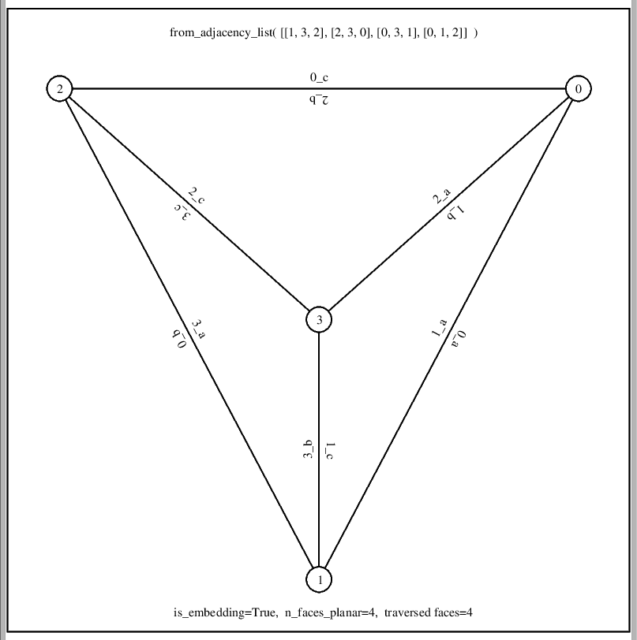
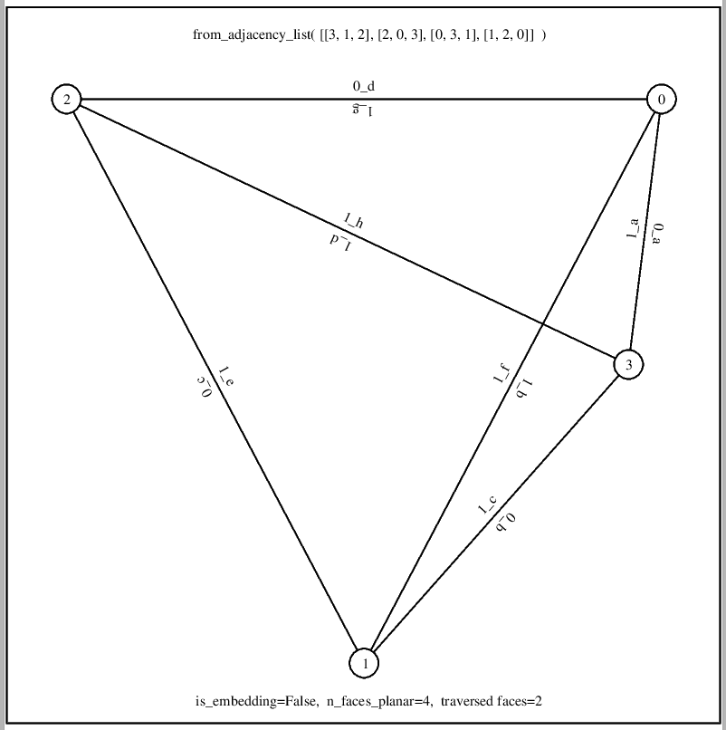

# planar_graph_playground (Python)
Python playground for drawing planar graphs (eg. fullerenes) in Mathplotlib, or as eg. PostScript file with command line tool rpy (run Python script) and "Python with C includes" script. The Python libs will be kept in sync with JavaScript libs one directory up. The design goal was to keep these libs as similar as possible to JavaScript libs, therefore camelCase is not used at all.

## undirected_graph.py

Implementation of undirect graph as well as embedding functions.  

## fullerenes.py

Sample fullerenes C20, C30, ..., C70 adjacency lists. [fullerenes.py](fullerenes.py) reads "../fullerenes.js" and parses the arrays from there to avoid duplicate data.

## ps.py

Allows for PostSxcript output, drawing of vertices, edges and complete graph (straight line drawing) when passing vertex coordinates. See [embedding_demo.py](embedding_demo.py) for what can be done by latest feature of drawing edge labels as well. That demo creates 2-page Postscript file, and ```evince``` cannot show the second page. I use GhostView (```gv```) to display Postscript files after realizing that, which I used in the early 90s as well for viewing code generated Postscript files ;-)

## Executing Python with C #include statements using rpy tool

C preprocessor #include statements are made available for Python with [rpy](rpy) tool (Run Python) for Python execution:  

    #!/bin/bash
    gcc -E -x c -nostdinc $1 | grep -v "^#"  | python


### python_dual.py

[python_dual.py](python_dual.py) is simple example Python script for testing Python graph functions including "dual_graph()" function.  

Sample execution:  

    pi@pi400-64:~/planar_graph_playground/python $ ./rpy python_dual.py 
    is_embedding(K5-e) verified, has 6 faces
    K5-e: 5 vertices, 9 edges
    0: (0)1 (1)2 (2)3 (3)4
    1: (4)2 (0)0 (5)4
    2: (6)4 (7)3 (1)0 (4)1
    3: (8)4 (2)0 (7)2
    4: (5)1 (3)0 (8)3 (6)2
    is_embedding(dual_graph(K5-e)) verified, has 5 faces
    dual_graph(K5-e): 6 vertices, 9 edges
    0: (0)1 (5)4 (3)3
    1: (0)0 (1)2 (4)4
    2: (1)1 (2)3 (7)5
    3: (2)2 (3)0 (8)5
    4: (4)1 (6)5 (5)0
    5: (6)4 (7)2 (8)3
    is_embedding() for C20, its dual and dual(dual()) verified
    is_embedding() for C30, its dual and dual(dual()) verified
    is_embedding() for C40, its dual and dual(dual()) verified
    is_embedding() for C50, its dual and dual(dual()) verified
    is_embedding() for C60, its dual and dual(dual()) verified
    is_embedding() for C70, its dual and dual(dual()) verified
    pi@pi400-64:~/planar_graph_playground/python $ 

## embedding_demo.py

[embedding_demo.py](embedding_demo.py) demonstrates how ```is_embedding(G)``` works, by doing ```planar_face_traversal(G)``` and counting faces. ```G``` is an embedding only, if determined number of faces is ```2 + n_vertices(G) - n_edges(G)```.  

2-page Postscript file [ed.ps](../res/ed.ps) created and viewed with these commands (```gv``` is GhostView):  

    pi@pi400-64:~/planar_graph_playground/python $ ./rpy embedding_demo.py > ed.ps
    pi@pi400-64:~/planar_graph_playground/python $ gv ed.ps

Screenshot of first page of Postscript file created, showing an embdding of complete graph on 4 vertices, created with ```from_adjacency_list()```. The left number of edge labels gives the face number, the right letters describe the order the edges of that face have been traversed (a, b, ...). Traversal of a face with edge e, from vertex v is done in ```traverce_face()``` by:

    v = opposite(G, v, e)
    e = next_adjacent_edge(G, v, e)

Next adjacent edge is next (cyclical) in clockwise order of shown vertex:  


Screenshot of 2nd page of Postscript file created, showing a drawing of complete graph on 4 vertices, created with ```from_adjacency_list()```, which is no embedding. As printed below, G would need 4 faces in traversal for being a planar graph, but as the drawing shows, only two "faces" were traversed:  


